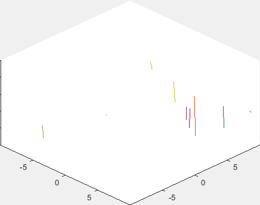

# Orbital Simulation in MATLAB
This is a project I did for a tutorial/class in MATLAB. It was meant to be practice with the syntax, but I mostly used it as practice making a UI that I could use to simulate different scenarios. 
It takes an arbitrary arrangement of point-like, charged, massive particles and allows them to interact. 

## How to Use
_(Disclaimer: I haven't actually tested this since 2015, but the last time I touched it was a live demonstation in front of my class and it worked fine then.)_

Just run `main.m`. You should get a plot window showing you the trajectories of the particles in real-ish time.
You can choose between different scenarios by changing the `scenario` variable on line 8 as per the comments following it. There are some other scenarios, but I think they still have some small bugs in them. 

## Lessons Learned
Originally, I wanted to be able to swap in different solver algorithms, rather than just using Euler's method. At the time, I didn't know about the concept of functions as objects, so I wasn't able to make the code solver-agnostic before I presented it.

I mostly got to practice passing flags to functions and subroutines, so I could control how each scenario was displayed. (If I recall, the vast majority of my time was spent figuring out the best ways to visualize each scenario.)

Retrospectively, I think the biggest thing I learned was how difficult things are when you don't know the right concept to use. (In this case, functions as objects.) I got a lot of practice using plots to diagnose bugs, rather than print statements. That ended up being useful when I wrote my [restricted 3-body simulation in R](github.com/Joedang/restricted_three_body_problem). 

## Images
Most of these use different visualization schemes. Generally, the red circles are the ideal circular orbits and anything else is the real trajectory of the particle.

A moon orbiting a planet orbiting a star. (The star is out of the frame.)  
  
  

A system of planets orbiting a star. They are initialized with random masses and circular orbits. You can see a collision in the upper right.  
  
  

Demontrations of the inaccuracy of Euler's method. The planets gain energy as they overshoot their theoretical trajectories.   
  
  

3D motion of randomized particles in a box.  
  
