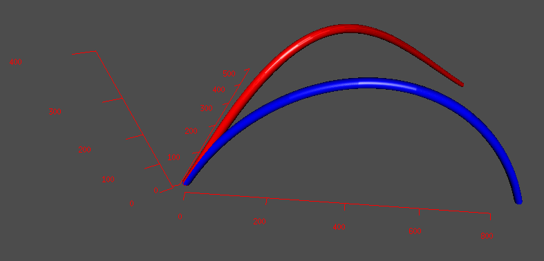

# Projectile Simulation
This simulation is based on an implementation of the Runge-Kutta 4th order method given to me by one of my professors.
This was a for-funzies project to practice R, which I had learned a few months prior, and to apply the things I was learning in my classical mechanics course.
I ported his implementation from C++ to R and applied it to look at projectile motion, taking into account buoyancy, high Reynolds number drag, centrifugal, and Corriolis effects.
This is done in Cartesian coordinates, so it assumes the range and apogee of the trajectories are small compared to the diameter of the planet. 
I also made a small table of realistic values for projectiles and planets (found in `projectile.csv` and `planet.csv` respectively), so the user can experiment with which real-world scenarios show which effects.

## How to Use
First, the `rgl` and `scales` libraries must be in stalled (along with R, obviously). `rgl` can be a little obnoxious to install since it has a lot of dependencies, but it's really useful for viewing the 3D effects of the Corriolis [pseudo] force. 
You might want to change the `setwd()` on line 6 to something that makes sense for your machine.

You can select different projectiles and planets by changing the value of `projName` and `planetName` near line 31 in `main.R`. You can change the launch parameters -- speed, angle, lattitude -- by changing `v0`, `theta0`, and `latt`.

If everything is working, you should get an OpenGL window showing the trajectory.
The blue trajectory shows the idealized parabolic path (no air, inertial reference frame), while the red trajectory shows the 'true' path (drag, buoyancy, centrifugal, and Corriolis effects included).

## Problems
The default data type for floats in R isn't able to handle the very large values of some variables like `K1X`. I tried bringing in a library that does arbitrary precision, but had problems with getting R to default to the new types introduced by that library.
If, for example, you try to set up a scenario on Earth where Corriolis effects are noticeable, something will almost certainly overflow and become `Inf`.

Since this is one of my earlier coding projects, there's a fair amount of bad practicies shown here. Oh well.
Some of the variable names are a little pathological, for example `c` which is also the name of the concatenation function!
Some lines and functions are a lot bigger than they should be. Some stuff that really should be commented isn't.

I don't really plan on fixing any of these problems, since I'd rather just rewrite the program.

## Lessons Learned
The main thing I got out of this project was practice finding and diagnosing bugs. At the time, I wasn't really familiar with the error messages in R and was accustomed to the break-point features in MATLAB and Visual Studio.
I also got my feet wet with searching for outside libraries to solve problems.
